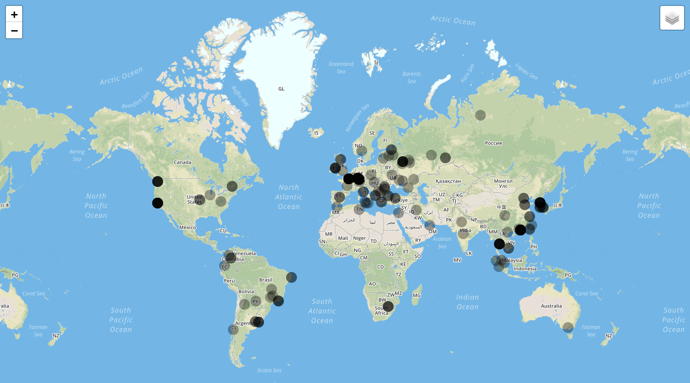

# serverlog2map
> Visualize IP address locations from server logs on a map.



*Depending on your final configuration, this is what the web-based map may look like!*

## Requirements

- Python 3.6+
- Flask, grequests and their dependencies

## Installing

Just clone this repo and install the requirements using `pip`:

```bash
git clone https://github.com/linusg/serverlog2map.git
cd serverlog2map
pip install -r requirements.txt
```

Consider using a virtual environment.

## Running

For development or quick testing you can use the `werkzeug` server which ships with Flask. Make sure you are in the
top-level directory of this repository and run:

```bash
export FLASK_APP=serverlog2map
flask run
```

## Deployment

I prefer a combination of `uwsgi` and `nginx`. Use whatever WSGI server and setup you prefer :)

Example configuration:

- Install `uwsgi`, e.g. in a virtualenv located at `/var/www/serverlog2map/.venv`.
- Make sure ownerships are correct (`www-data` should be the executing user, 
  `chown -R www-data:www-data /var/www/serverlog2map` should to the trick - the easy way :P ) 
- You may want to create a systemd service unit (e.g. `/etc/systemd/system/serverlog2map.service`):

    ```
    [Unit]
    Description=serverlog2map systemd service unit
    After=network.target
    
    [Service]
    User=www-data
    Group=www-data
    WorkingDirectory=/var/www/serverlog2map
    Environment=/var/www/serverlog2map/.venv/bin
    ExecStart=/var/www/serverlog2map/.venv/bin/uwsgi --ini /var/www/serverlog2map/wsgi.ini
    
    [Install]
    WantedBy=multi-user.target
    ```
- uWSGI configuration (e.g. `/var/www/serverlog2map/wsgi.ini`):

    ```
    [uwsgi]
    module = serverlog2map:app
    logto=serverlog2map.log
    socket = serverlog2map.sock
    chmod-socket = 660
    processes = 5
    master = true
    vacuum = true
    die-on-term = true
    ```
- Update Nginx config, e.g. add:

    ```
    location /serverlog2map {
        include uwsgi_params;
        uwsgi_pass unix:///var/www/serverlog2map/serverlog2map.sock;
    }
    ```
- Restart Nginx
- Start and optionally activate the service with `systemctl`.

## Configuration

You can create a file `config.json` in the top-level directory of this repository to overwrite some or even all default
values, which are shown below:

```json
{
    "log_dir": "/var/log/nginx",
    "file_pattern": "access.log*",
    "marker_color": "#00000055",
    "marker_size": 20,
    "regex_request": "([(\\d\\.)]+) .*? (.*?) \\[(.*?)\\] \"(.*?) (.*?) (.*?)\" (\\d+) (\\d+)(?: \"(.*?)\" \"(.*?)\")?",
    "regex_request_invalid": "([(\\d\\.)]+) .*? (.*?) \\[(.*?)\\] \".*?\" (\\d+) (\\d+)(?: \"(.*?)\" \"(.*?)\")?",
    "time_format": "%d/%b/%Y:%H:%M:%S %z",
    "ignore_local": true
}
```

## Contributing

Contributions and bug reports are always welcome!

## License

This project is licensed under the MIT License - see the [LICENSE](LICENSE) file for details.
